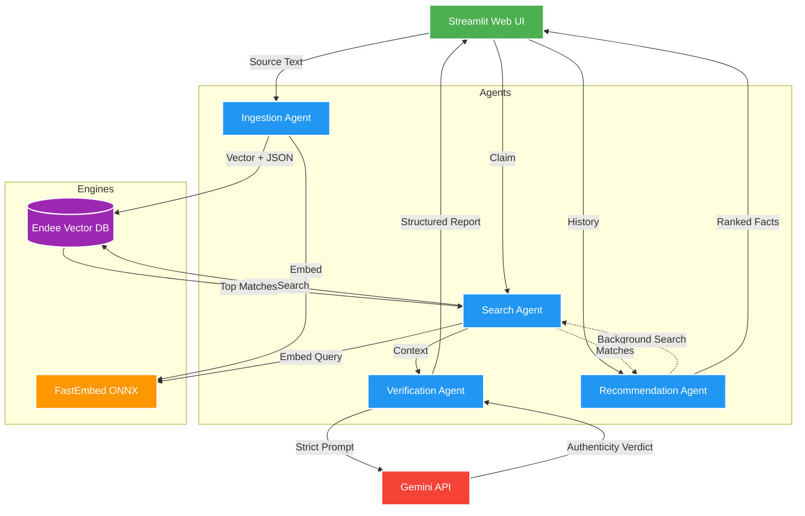

# FactVerifierSystem

🚀 Live Demo: https://fact-verifier-app.onrender.com

## ProjectOverview

FactVerifier is a multiagent AI fact verification platform. Users paste articles, social media posts, or any text into a knowledge base. The system then evaluates user claims by searching that knowledge base using vector similarity and uses the Gemini LLM to deliver a structured verdict: Authentic, Fake, or InsufficientEvidence.

---

## Architecture

The backend uses a modular multiagent pipeline written in Python. A single-page Streamlit application wraps the pipeline and provides a three-tab interface. The Endee vector database stores and retrieves embeddings. The embedding engine is fastembed, which runs the BAAI/bge-small-en-v1.5 model via ONNX Runtime without any PyTorch dependency. Gemini is called via its standard HTTP REST API.



---

## AgentsAndRoles

### IngestionAgent

Accepts a text input, generates a 384-dimensional ONNX embedding using fastembed, and inserts the embedding along with the original text as a payload into the Endee vector database.

### SearchAgent

Accepts a user query, generates its embedding using fastembed, and performs a vector similarity search in Endee. Returns the top K matching knowledge cards as structured Python dictionaries.

### VerificationAgent

Receives the user query and the retrieved knowledge cards. Calls the Gemini REST API directly using the requests library. Enforces a strict prompt that prohibits the model from using any knowledge outside the provided cards. Returns a formatted decision report.

### RecommendationAgent

Tracks the last five to six queries made by the user in the current session. For each query it runs a similarity search against Endee. Merges and deduplicates the results, sorts them by descending similarity score, and returns the top five recommendations.

---

## FolderStructure

```
FactVerifier/
agents/
    __init__.py
    ingestion_agent.py
    search_agent.py
    verification_agent.py
    recommendation_agent.py
utils/
    endee_client.py
app.py
Dockerfile
requirements.txt
.env.example
README.md
```

---

## EmbeddingLayer

Embeddings are generated using the fastembed library. The model is BAAI/bge-small-en-v1.5, which produces 384-dimensional dense vectors. fastembed downloads and caches the ONNX model weights on first run and requires no PyTorch, GPU, or native compilation. On subsequent runs it loads from local cache and works completely offline.

---

## EndeeIntegration

Endee is the vector database. It runs as a Docker container on localhost port 8080. The EndeeClient utility wraps the Endee HTTP REST API. It handles index creation, single vector insertion, and vector similarity search. Search results are returned in MessagePack binary format and decoded using the msgpack library. Each stored record contains the vector and the original text as a JSON-encoded metadata string.

---

## GeminiIntegration

Gemini is called using a direct HTTP POST to the Google Generative Language REST API. No SDK is used. The endpoint format is:

```
POST https://generativelanguage.googleapis.com/v1/models/{model}:generateContent?key={api_key}
```

The model defaults to gemini-2.5-flash. This can be overridden using the GEMINI_MODEL environment variable without changing any code. The prompt strictly instructs Gemini to use only the provided knowledge cards as evidence.

---

## SearchLogic

1. User query is embedded using fastembed into a 384-dimensional vector.
2. The vector is sent to Endee via HTTP POST to the index search endpoint.
3. Endee returns the top K results sorted by cosine similarity.
4. Each result is decoded from MessagePack and the text payload is extracted.

---

## VerificationLogic

1. The top K search results and the original query are passed to the VerificationAgent.
2. A structured prompt is built that injects all knowledge cards as context.
3. Gemini is called via the REST API with a strict system instruction.
4. The response is returned as a formatted text block with Decision, Confidence, EvidenceSummary, Reasoning, and CitedKnowledgeCards fields.
5. If no context cards exist, InsufficientEvidence is returned immediately without calling Gemini.

---

## RecommendationLogic

1. The Streamlit session maintains a rolling list of the last six user queries.
2. The RecommendationAgent calls SearchAgent for each query in the history using top 2 results per query.
3. All results are merged into a single dictionary keyed by text to deduplicate.
4. The dictionary values are sorted by similarity score in descending order.
5. The top five are returned and displayed in Tab 3.

---

## EnvironmentVariables

Copy the .env.example file to a new file named .env and populate the following keys.

```
GEMINI_API_KEY=your_gemini_api_key_here
ENDEE_API_URL=http://localhost:8080/api/v1
GEMINI_MODEL=gemini-2.5-flash
```

GEMINI_API_KEY is required. ENDEE_API_URL defaults to localhost if not set. GEMINI_MODEL defaults to gemini-2.5-flash if not set.

---

## RunLocally

Prerequisites: Python 3.10 or higher, Docker Desktop installed and running.

Step 1: Start Endee vector database
```
docker run --ulimit nofile=100000:100000 -p 8080:8080 -d -v ./endee-data:/data --name endee-server --restart unless-stopped endeeio/endee-server:latest
```

Step 2: Create and activate virtual environment
```
python -m venv venv
venv\Scripts\Activate.ps1       (Windows PowerShell)
source venv/bin/activate        (macOS or Linux)
```

Step 3: Install dependencies
```
pip install -r requirements.txt
```

Step 4: Set up environment variables
```
copy .env.example .env
```
Open .env and paste your Gemini API key.

Step 5: Run the app
```
python -m streamlit run app.py
```

The app opens in your browser at http://localhost:8501.

---

## CloningAndRunningOnADifferentSystem

To run this project on a new machine follow these steps exactly.

Step 1: Clone the repository
```
git clone https://github.com/your-username/FactVerifier.git
cd FactVerifier
```

Step 2: Install Docker Desktop
Go to https://docs.docker.com/get-docker and install Docker for your operating system. Start Docker Desktop and wait for it to fully load before continuing.

Step 3: Start Endee database
```
docker run --ulimit nofile=100000:100000 -p 8080:8080 -d -v ./endee-data:/data --name endee-server --restart unless-stopped endeeio/endee-server:latest
```
Verify it is running by visiting http://localhost:8080 in your browser.

Step 4: Create Python virtual environment
```
python -m venv venv
```
Activate it:
- Windows:  `venv\Scripts\Activate.ps1`
- Mac/Linux: `source venv/bin/activate`

Step 5: Install dependencies
```
pip install -r requirements.txt
```
On first run, fastembed will download the ONNX model weights (roughly 130MB). This happens once and is cached locally for all future runs.

Step 6: Configure environment
```
copy .env.example .env
```
Open the .env file and replace the placeholder with your actual Gemini API key. Get a free key at https://aistudio.google.com/app/apikey.

Step 7: Start the application
```
python -m streamlit run app.py
```
The application will open at http://localhost:8501.

---

## RunWithDockerCompose

The most seamless way to run both the Endee database and the FactVerifier interface together is using Docker Compose.

Step 1: Configure environment
```
copy .env.example .env
```
Open the .env file and paste your Gemini API key.

Step 2: Start the stack
```
docker compose up --build -d
```

Step 3: Access the app at http://localhost:8501.

To stop the services, run:
```
docker compose down
```

---

## AssumptionsAndLimitations

1. Endee must be running before the Streamlit app starts. The app will fail to ingest or search if Endee is offline.
2. The knowledge base is only as good as what is ingested. If no relevant facts exist, Gemini will return InsufficientEvidence.
3. Recommendation history is stored in Streamlit session state and resets when the browser tab is refreshed.
4. fastembed downloads the ONNX model on first run and requires internet access for that step only.
5. The Endee HTTP API endpoints used for insertion and search follow the Endee open-source REST specification as found in the main.cpp source.

---

## ExactWorkflow

1. Ingestion: User pastes text in Tab 1. IngestionAgent embeds it using fastembed ONNX. The vector and text are stored in Endee.
2. Search and Verification: User types a claim in Tab 2. SearchAgent embeds the query. Endee returns the closest matching cards. VerificationAgent calls Gemini REST API with the cards as context. The structured report is displayed.
3. Recommendation: User clicks Get Recommendations in Tab 3. RecommendationAgent uses the session query history to find relevant cards. Top results are displayed ranked by similarity.
